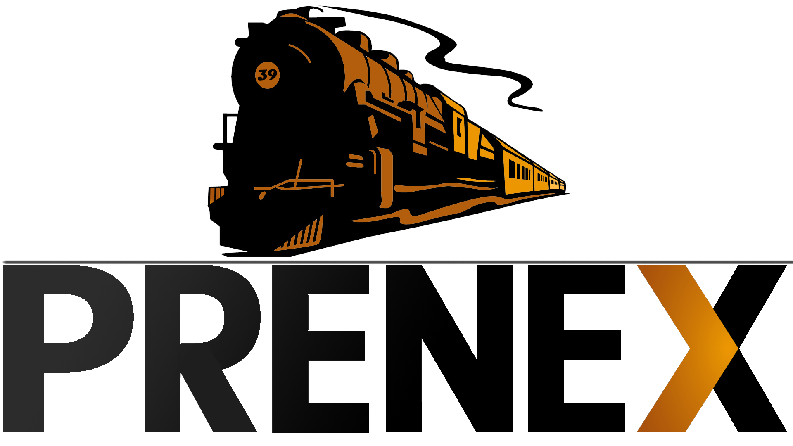

# PREN - Team39

 

PREN Code von Team39 - 2018/2019.  
Die Software ist Modular aufgebaut und in verschiedenen Folder gegliedert

## doc

Hier befindet sich die Konfiguration sowie das Bash Script, mit welchem der Raspberry Pi nach einer frischen Installation konfiguriert wird.  

## sensors

Hier befindet sich Code, mit welchem einige der Sensoren (TOF VL6180x, HC-SR04) welche im Rahmen des Projekt verwendet wurden, angesprochen werden können.

## tests

Hier befindet sich der Gesamte, unstrukturierte, teilweise chaotische Code, mit welchem im Rahmen des Moduls PREN diverse Teilfunktionen getestet und validiert wurden. Vorallem im Bereich Signalerkennung sind einige interessante beispiele und Ansätze mit dabei, mit welche rdas Problem angegangen werden kann.

## src

Hier befindet sich der produktive Code, welcher am Wettbewerb zum Einsatz kam, um den Zug autonom fahren zu lassen. 

**ETArduino**  

Der Code für den Arduino Mega ADK

**maintrain_statemachine**

Der Hauptprogrammcode für den Raspberry Pi 3B+

**speedcontroller**

Eine kleine nützliche Applikationen um den Zug manuell zu steuern.

